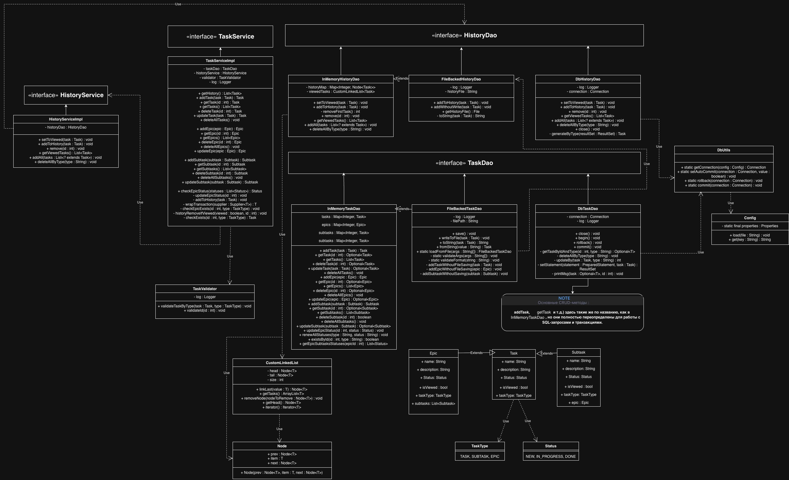
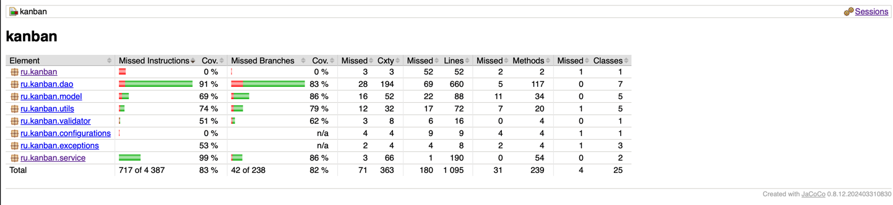

# Описание

## Kanban - `Трекер задач`

* **Проект позволяет хранить задачи и отслеживать статусы выполнения различных задач**

---

* Задачи делятся на три типа:
    * `Задача`
    * `Эпик` - Более крупная задача, которая состоит из нескольких подзадач)
    * `Подзадача` - Составляющая Эпика

* Так же предоставляет следующий функционал:
    * Добавлять задачу
    * Читать задачу
    * Обновлять задачу
    * Удалять задачу
    * Хранить историю просмотра последних 10ти задач
    * Читать историю просмотра

---

### Технологии, используемые в проекте:

* `Java 17`
* `PostgreSQL` / `H2` - Хранение данных в БД
* `Liquibase` - Управление миграцией БД
* `JUnit` / `AssertJ` - Тестирование
* `JaCoCo` - Анализ покрытия тестами
* `Log4j` / `Slf4j` - Логирование
* `Maven` - Сборка проекта
* `CheckStyle` - проверка качества кода

---

## Конфигурации.

* ### [Config](src/main/java/ru/kanban/configurations/Config.java)

Класс предназначен для работы с конфигурацией приложения.

* Содержит поле properties : Properties, которое хранит параметры из конфигурационного файла
  [liquibase.properties](src/main/resources/db/liquibase.properties)

    * Основные методы:

* `load(String file)`: `void` — загружает свойства из указанного файла.

* `get(String key)`: `String` — возвращает значение свойства по ключу.

* ### [log4j.properties](src/main/resources/log4j.properties) - конфигурационный файл для настроек логирования.

---

## Модели данных:

### 1. [Task](src/main/java/ru/kanban/model/Task.java)

Класс Представляет собой модель данных, описывающую задачу.

* ***Включает следующие поля***:
    * `name` : `String` - имя задачи.
    * `description` : `String` - описание задачи.
    * `id` : `int` - уникальный идентификатор задачи
    * `status` : `Status` - объект описывающий статус выполнения задачи.
    * `isViewed` : `boolean` - статус просмотра задачи.
    * `type` : `TaskType` - тип задачи.

Этот класс содержит `геттеры`, `сеттеры`, `toString`(),
а так же переопределенные `equals` & `hashcode` для корректного сравнения объектов.

***<ins>Сравнение объектов происходит по ID</ins>.***

### 2. [Epic](src/main/java/ru/kanban/model/Epic.java)

### Расширяет [Task](src/main/java/ru/kanban/model/Task.java)

* Включает поле `subtasks` : `List<Subtask>` - список подзадач
*

Этот класс содержит `геттеры`, `сеттеры`, `toString`(),
а так же переопределенные `equals` & `hashcode` для корректного сравнения объектов.

***Сравнение объектов происходит по ID, и полю subtasks.***

* ***Метод*** `updateStatus`() : `void` - обновляет статус эпика.

### 3. [Subtask](src/main/java/ru/kanban/model/Subtask.java)

### Расширяет [Task](src/main/java/ru/kanban/model/Task.java).

* Включает поле `epic` : `Epic` - эпик к которому относится подзадача
*

Этот класс содержит `геттеры`, `сеттеры`, `toString`(),
а так же переопределенные `equals` & `hashcode` для корректного сравнения объектов.

**Сравнение объектов происходит по ID подзадачи и ID Эпика.***

### 4. [Status](src/main/java/ru/kanban/model/Status.java)

Этот класс описывает статусы всех типов задач

* NEW - новая задача.
* IN_PROCESS - в процессе выполнения.
* DONE - выполненная задача.

### 5. [TaskType](src/main/java/ru/kanban/model/TaskType.java)

Этот класс описывает типы задач в соответствии с типом данных каждой задачи.

---

---

## Доступ к данным.

* ### [TaskDao](src/main/java/ru/kanban/dao/TaskDao.java)(Интерфейс) - задает контракт для хранилища задач.
    * ***Методы:***
        * `addTask(Task task)` : `Task` - добавляет задачу в хранилище.
        * `getTask(int id)` : `Optional<Task>` - читает задачу по ID.
        * `getTasks()` : `List<Task>` - получение списка всех задач.
        * `deleteTask(int id)` : `Optional<Task>` - удаление задачи по ID.
        * `updateTask(Task task)` : `Optional<Task>` - обновление задачи.
        * `deleteAllTasks() `: `void` - удаление всех задач.
        * `addEpic(Epic epic)` : `Epic` - добавляет эпик в хранилище.
        * `getEpic(int id)` : `Optional<Epic> `- читает эпик по ID.
        * `getEpics()` : `List<Epic>` - получение списка всех Эпиков.
        * `deleteEpic(int id)` : `Optional<Epic>` - удаляет эпик по ID.
        * `deleteAllEpics()` : `void` - удаляет все эпики.
        * `updateEpic(Epic epic)` : `Optional<Epic>` - обновляет эпик.
        * `addSubtask(Subtask subtask)` : `Subtask` - добавляет подзадачу в хранилище.
        * `getSubtask(int id)` : `Optional<Subtask> `- читает подзадачу по ID.
        * `getSubtasks()` : `List<Subtask>` - получение списка всех подзадач.
        * `deleteSubtask(int id)` : `boolean` - удаляет подзадачу.
        * `deleteAllSubtasks()` : `void` - удаляет все подзадачи.
        * `updateSubtask(Subtask subtask)` : `Optional<Subtask>` - обновляет подзадачу.
        * `renewAllStatuses(String type, String status)` : `void` - обновляет все статусы задач по типу и переданному
          статусу.
        * `getEpicSubtasksStatuses(int epicId)` : `List<Status>` - получает список всех статусов подзадач по ID эпика.
        * `existsById(int id, String type)` : `boolean` - проверяет существование задачи с соответствующим типом по ID.

        * Методы по умолчанию для работы с БД(без реализации) :
            * `begin()` : `void` - начало транзакции.
            * `rollback()` : `void` - откат транзакции.
            * `commit()` : `void` - сохранение результата выполнения транзакции.

    * #### [InMemoryTaskDao](src/main/java/ru/kanban/dao/InMemoryTaskDao.java)

Класс реализовывает интерфейс <ins>[TaskDao](src/main/java/ru/kanban/dao/TaskDao.java)</ins>
Хранит объекты в памяти.

**** Содержит поля:***
    * `tasks` : `Map<Integer, Task>` - хранилище задач
    * `epics` : `Map<Integer, Epic>` - хранилище эпиков
    * `subtasks` : `Map<Integer, Subtask>` - хранилище подзадач
    * `ids` : `int`- хранит актуальный id для задач

***Методы:***

* Реализовывает все контрактные методы интерфейса

* #### [FileBackedTaskDao](src/main/java/ru/kanban/dao/FileBackedTaskDao.java)

Класс расширяет <ins>[InMemoryTaskDao](src/main/java/ru/kanban/dao/InMemoryTaskDao.java)</ins>
Хранит объекты в csv файле.

***Содержит поля:***

* `log` : `Logger` - для логирования исключений.
* `filePath` : `String` - путь к файлу для записи / чтения задач

***Методы:***

* Базовые реализации родительского класса, с доп. логикой записи в файл и актуализации данных хранилища.
* `save()` : void - актуализирует данные хранилища в файле.
* `writeToFile(Task task)` : `void` - выполняет запись задачи в файл.
* `toString(Task task)` : `String` - сериализирует POJO в текстовое представление в файл.
* `fromString(String value)` : `Task` - десериализирует задачу из текста в POJO.
* `loadFromFile(String[]args)` : `FileBackedTaskDao` - загружает актуальное состояние хранилище из файла, в память.

* #### [DbTaskDao](src/main/java/ru/kanban/dao/DbTaskDao.java)

Класс реализовывает <ins>[TaskDao](src/main/java/ru/kanban/dao/TaskDao.java)</ins>
Хранит задачи в БД.

***Содержит поля:***

* `connection` : `Connection` - для соединения с БД.
* `log` : `Logger` - для логирования исключений и отладки.

***Методы:***

* Реализовывает все контрактные методы интерфейса, выполняя запросы в БД.

* ### [HistoryDao](src/main/java/ru/kanban/dao/HistoryDao.java)(Интерфейс) - задает контракт для хранения задач в истории.
* ***Методы:***
* `setToViewed(Task task)` : `void` - помечает задачу как просмотренную.
* `addToHistory(Task task)` : `void` - добавление задачи в историю.
* `remove(int id)` : `void` - удаление из истории по ID.
* `getViewedTasks()` : `List<Task>` - получение списка просмотренных задач.
* `addAll(List<? extends Task>)` : `void` - добавление списка всех задач.
* `deleteAllByType(String type)` : `void` - удаление всех задач из истории, по заданному типу.
    * #### [InMemoryHistoryDao](src/main/java/ru/kanban/dao/InMemoryHistoryDao.java)

Класс реализовывает <ins>[HistoryDao](src/main/java/ru/kanban/dao/HistoryDao.java)</ins>.
Хранит историю просмотренных задач в памяти.
Содержит поля:

* `historyMap` : `Map<Integer, Node<Task>>` - обеспечивает мгновенный поиск узла в списке по id задачи.
* `viewedTasks` : `CustomLinkedList` - двусвязный список, хранящий порядок просмотров.

Методы:

* Реализовывает все контрактные методы интерфейса.
    * #### [FileBackedHistoryDao](src/main/java/ru/kanban/dao/FileBackedHistoryDao.java)

Класс расширяет <ins>[InMemoryHistoryDao](src/main/java/ru/kanban/dao/InMemoryHistoryDao.java)</ins>.
Хранит объекты в csv файле.
Содержит поля:

* `log` : `Logger` - для логирования исключений.
* `historyFile` : `String` - путь к файлу хранения истории.

Методы:

* Включает все базовые реализации родительского класса, с доп. логикой записи в файл.
* `addWithoutWrite(Task task)` : `void` - добавление в хранилище в памяти, без записи в файл.
* `getHistoryFile` : `File` - получить файл с историей.
* #### [DbHistoryDao](src/main/java/ru/kanban/dao/DbHistoryDao.java)

Класс реализовывает  <ins>[HistoryDao](src/main/java/ru/kanban/dao/HistoryDao.java)</ins>.
Хранит историю в БД.
Содержит поля:

* `connection` : `Connection` - для соединения с БД.
* `log` : `Logger` - для логирования исключений и отладки.

Методы:

* Реализовывает все контрактные методы интерфейса, выполняя запросы в БД.

---

---

## Сервисы и бизнес логика.

### [TaskService](src/main/java/ru/kanban/service/TaskService.java) - интерфейс описывающий основную бизнес - логику приложения.

***Методы:***

* `getHistory()` : `List<Task>` - получение списка просмотренных задач

* `addTask(Task task)` : `Task` - добавление задачи

* `getTask(int id)` : `Task` - получение задачи по ID.

* `getTasks()` : `List<Task>` - получение списка задач.

* `deleteTask(int id)` : `Task` - удаление задачи по ID.

* `updateTask(Task task)` : `Task` - обновление задачи.

* `deleteAllTasks()` : `void` - удаление всех задач.

* `addEpic(Epic epic)` : `Epic` - добавление эпика.

* `getEpic(int id)` : `Epic` - получение эпика по ID.

* `getEpics()` : `List<Epic>` - получение списка эпиков.

* `deleteEpic(int id)` : `Epic` - удаление эпика по ID.

* `deleteAllEpics()` : `void` - удаление всех эпиков.

* `updateEpic(Epic epic)` : `Epic` - обновление эпика.

* `addSubtask(Subtask subtask)` : `Subtask` - добавление подзадачи.

* `getSubtask(int id)` : `Subtask` - получение подзадачи по ID.

* `getSubtasks()` : `List<Subtask>` - получение всех подзадач.

* `deleteSubtask(int id)` : `Subtask` - удаление подзадачи по ID.

* `deleteAllSubtasks()` : `void` - удаление всех подзадач.

* `updateSubtask(Subtask subtask)` : `Subtask` - обновление подзадачи.

* `checkEpicStatus(List<Status> statuses)` : `Status` - пересчет статусов эпика по статусам подзадач принадлежащих
  конкретному эпику.

    * ### [TaskServiceImpl](src/main/java/ru/kanban/service/TaskServiceImpl.java)

Базовая реализация - [TaskService](src/main/java/ru/kanban/service/TaskService.java).

В которой содержатся следующие бизнес правила:

***Содержит поля:***

* `taskDao` : `TaskDao` - ДАО для доступа к данным и хранении в соответствии с выбранным ДАО.
* `historyService` : `HistoryService` - сервис отвечающий за управление хранилищем истории.
* `validator` : `TaskValidator` - для валидации данных.
* `log` : `Logger` - для логирования исключений, и отладки.

Содержит реализацию всех контрактных методов интерфейса включая валидацию задач и следующие <ins>
***бизнес - правила***</ins>:

1) При чтении любой задачи(или всех задач) - задача так же автоматически становится "просмотренной" и попадает в
   хранилище истории.
2) При удалении любой задачи или всех задач(по типу), так же происходит и удаление из истории.
3) При обновлении задач, так же происходит удаление из истории если обновлённая задача, помеченная как "не просмотрена."

<ins>***Валидацию***</ins>:

4) Проверки на существование задач.
5) Проверки на null при добавлении.
6) Проверки на соответствие типа задач при чтении.
7) Проверки на содержание имени задачи.
8) Проверки на корректность ID задачи.

<ins>***Логирование***</ins>:

9) Всех CRUD - операций.
10) Всех исключений при падении соединения с БД, работы с файлами, ошибок при валидации и т.п.

---

---

### Утилиты.

#### [Constants](src/main/java/ru/kanban/utils/Constants.java) - содержит заголовок для работы с файлами csv.

#### [CustomLinkedList](src/main/java/ru/kanban/utils/CustomLinkedList.java) - двусвязный список для обеспечения более быстрого удаления за О(1).

#### [DbUtils](src/main/java/ru/kanban/utils/DbUtils.java) - утилитарный класс для работы с БД, и управления транзакциями.

#### [Managers](src/main/java/ru/kanban/utils/Managers.java) - фабрика менеджеров(дао).

#### [Node](src/main/java/ru/kanban/utils/Node.java) - узел хранящий задачи.

---

---

### Валидация.

#### [TaskValidator](src/main/java/ru/kanban/validator/TaskValidator.java)

***Класс отвечающий за валидацию задач в проекте.***

Содержит поля:

* `log` : `Logger` - логирование всех исключений.

Методы:

* `validateTaskByType` : `void` - для валидации задач на null, содержание имени и корректности типа задачи.
* `validateId(int id)` : `void` - валидация ID.

---

---

### Исключения.

***[DaoException](src/main/java/ru/kanban/exceptions/DaoException.java)***
***[ManagerSaveException](src/main/java/ru/kanban/exceptions/ManagerSaveException.java)***
***[TaskNotFoundException](src/main/java/ru/kanban/exceptions/TaskNotFoundException.java)***

---

---

### [Main](src/main/java/ru/kanban/Main.java).

Класс Main является точкой входа в приложение.

* Основной метод:
    * `main(String[] args)`: `void` - настраивает приложение и выполняет полный цикл его работы.

#### Архитектурные связи.

* `Task` - является основной моделью данных.
* `Epic` & `Subtask` - являются наследниками Task.
* `Status`, `TaskType` - перечисления статусов задач и их типов.
* `Config` - загружает параметры для работы с БД PostgreSQL.
* `TaskDao`, `InMemoryTaskDao`, `FileBackedTaskDao`, `DBTaskDao` - обеспечивают хранение данных.
* `HistoryDao`, `InMemoryHistoryDao`, `FileBackedHistoryDao`, `DbHistoryDao` - обеспечивают хранение последних 10 - ти
  просмотренных задач.
* `TaskService`, `TaskServiceImpl` - обеспечивают соблюдение бизнес - правил и используют DAO и HistoryService для
  доступа к данным и их управлением.
* `HistoryService`, `HistoryServiceImpl` - обеспечивают хранение и доступ к данным истории, используют HistoryDao.
* `Managers`, `DbUtils`, `CustomLinkedList`, `Node`, `Constants` - утилитарные классы для работы сервисов и дао.
* `TaskValidator` - обеспечивает валидацию данных.
* `DaoException`, `ManagerSaveException` - исключения работы с ***Dao***; `TaskNotFoundException` - ошибка при поиске задачи.
* `Main` - запускает приложение и связывает все компоненты.

#### Дополнительные ресурсы для работы приложения.

* ***[Scripts](src/main/resources/db/scripts)*** - каталог скриптов по созданию таблиц с предустановленными правилами в
  БД.
* ***[changelog](src/main/resources/db/dbchangelog.xml)*** - конфигурационный файл для автоматического запуска скриптов
  работы с БД в тестовой и пользовательской среде.
* ***[liquibase.properties](src/main/resources/db/liquibase.properties)*** - конфигурационный файл для подключения к БД
  и
  работы с ней.
* ***[log4j.properties](src/main/resources/log4j.properties)*** - конфигурационный файл для настроек логирования.
* ***[Kanban_schema](src/main/resources/Kanban_schema.jpg)*** - схема отношений сущностей в БД.

#### Расположение сведений о работе приложения → [logs](logs)

---

---

### Схема зависимостей проекта.

### Отчет о покрытии тестами.

